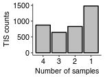
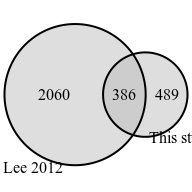
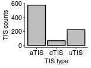
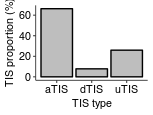
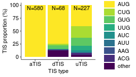
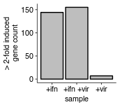
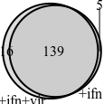
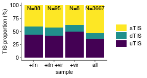
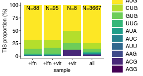

Statistics of called host start sites
================
rasi
02 November, 2018

-   [Import libraries and define analysis specific variables](#import-libraries-and-define-analysis-specific-variables)
-   [Read in called starts from our data and analysis of Lee PNAS 2012 data](#read-in-called-starts-from-our-data-and-analysis-of-lee-pnas-2012-data)
-   [Get combination of samples that each start occurs in](#get-combination-of-samples-that-each-start-occurs-in)
-   [Create combo with chromosome annotations for joining with unfiltered starts later](#create-combo-with-chromosome-annotations-for-joining-with-unfiltered-starts-later)
-   [Get combination of samples that each start occurs in Lee 2012](#get-combination-of-samples-that-each-start-occurs-in-lee-2012)
-   [Plot the proportion of TIS that are called in certain number of samples](#plot-the-proportion-of-tis-that-are-called-in-certain-number-of-samples)
-   [Distinct sample combinations for called TIS](#distinct-sample-combinations-for-called-tis)
-   [TIS common to all samples](#tis-common-to-all-samples)
-   [Plot overlap in called TIS between our high cofidence set and Lee 2012 high confidence set](#plot-overlap-in-called-tis-between-our-high-cofidence-set-and-lee-2012-high-confidence-set)
-   [Proportion of uTIS, aTIS, dTIS among common\_starts](#proportion-of-utis-atis-dtis-among-common_starts)
-   [Proportion of different codons in aTIS and dTIS for common starts](#proportion-of-different-codons-in-atis-and-dtis-for-common-starts)
-   [Get genes that are induced upon variout treatments.](#get-genes-that-are-induced-upon-variout-treatments.)
-   [Plot number of induced genes in each sample](#plot-number-of-induced-genes-in-each-sample)
-   [Plot the proportion of different TIS types among induced genes](#plot-the-proportion-of-different-tis-types-among-induced-genes)
-   [Test if uTIS or dTIS initiation is overrepresented among the induced genes in comparison with all genes](#test-if-utis-or-dtis-initiation-is-overrepresented-among-the-induced-genes-in-comparison-with-all-genes)
-   [Plot the proportion of different TIS codons among induced genes](#plot-the-proportion-of-different-tis-codons-among-induced-genes)
-   [Test for increased proportion of non-AUG TIS among induced genes](#test-for-increased-proportion-of-non-aug-tis-among-induced-genes)

In this notebook, we look at different statistics of host called start sites such as the proportion of uTIS/dTIS vs aTIS and non-AUG vs AUG TIS.

We do these analysis for all genes as well as the genes that are induced upon treatment with interferon, influenza virus, or both.

Import libraries and define analysis specific variables
=======================================================

``` r
library(tidyverse)
library(rasilabRtemplates)

# use this for labeling axis ticks
sample_names <- c(
  "vir" = "+vir",
  "ifn_vir" = "+ifn +vir",
  "untr" = "ctrl",
  "ifn" = "+ifn"
)

# use this for finding unique sample combinations
sample_numbers <- c(
  "vir" = 8,
  "ifn_vir" = 2,
  "untr" = 4,
  "ifn" = 1
)

# use this order to resolve multiple TIS within the same 5nt window and
# also to order codons during plotting
tis_priority <- seq(11)
names(tis_priority) <- c("AUG", "CUG", "GUG", "UUG", "AUA", "AUC", "AUU",
                     "AAG", "ACG", "AGG", "other")
```

Read in called starts from our data and analysis of Lee PNAS 2012 data
======================================================================

``` r
tis <- read_tsv("../tables/called_host_tis.tsv") %>% 
  mutate_at(vars(ends_with("_p")), funs(as.numeric)) %>% 
  mutate(sno = seq(1, n())) %>% 
  print()
```

    ## # A tibble: 8,576 x 18
    ##    codon canonical.start tis.start nt_to_atis frame chr.start chr   sample
    ##    <chr>           <int>     <int>      <int> <int>     <int> <chr> <chr> 
    ##  1 CUG               116        70        -46     2   7771339 chr1  ifn   
    ##  2 AUG               391       391          0     0  53940082 chr1  ifn   
    ##  3 GUG               121        59        -62     1   8878632 chr1  ifn   
    ##  4 ACG               121        94        -27     0   8878597 chr1  ifn   
    ##  5 AUG               121       121          0     0   8874907 chr1  ifn   
    ##  6 AUG               436       373        -63     0 184477446 chr1  ifn   
    ##  7 AUG               120       120          0     0  45012267 chr1  ifn   
    ##  8 AUG               132       132          0     0  26239784 chr1  ifn   
    ##  9 AUG                56        56          0     0 162790801 chr1  ifn   
    ## 10 AUG               173        17       -156     0  43970021 chr1  ifn   
    ## # ... with 8,566 more rows, and 10 more variables: gene_name <chr>,
    ## #   cyclo_p <dbl>, cyclo_n <int>, ltm_p <dbl>, ltm_n <int>,
    ## #   tis.chr.start <dbl>, peplen <int>, pep <chr>, tis.type <chr>,
    ## #   sno <int>

``` r
lee_2012_tis <- read_tsv("../tables/lee_2012_called_host_tis.tsv") %>%  
  mutate_at(vars(ends_with("_p")), funs(as.numeric)) %>% 
  mutate(sno = seq(1, n())) %>% 
  # this gets rid of a single misannotated tis
  filter(!is.na(nt_to_atis)) %>% 
  mutate (tis.type = case_when(
    nt_to_atis < 0 ~ "uTIS", 
    nt_to_atis == 0 ~ "aTIS", 
    nt_to_atis > 0 ~ "dTIS")) %>% 
  print()
```

    ## # A tibble: 8,353 x 17
    ##    codon canonical.start tis.start nt_to_atis frame chr.start chr   sample
    ##    <chr>           <int>     <int>      <int> <int>     <int> <chr>  <int>
    ##  1 CUG               116        43        -73     2   7771311 chr1       1
    ##  2 CUG               116        70        -46     2   7771339 chr1       1
    ##  3 AUG                71       138         67     1 114780541 chr1       1
    ##  4 CUG               372       327        -45     0  53888983 chr1       1
    ##  5 CUG               121        63        -58     2   8878629 chr1       1
    ##  6 AUG               121       121          0     0   8874908 chr1       1
    ##  7 AUG                76        76          0     0 109213993 chr1       1
    ##  8 AUG               436       373        -63     0 184477447 chr1       1
    ##  9 AUG               170        68       -102     0  12019533 chr1       1
    ## 10 AUA               143        99        -44     1  43172163 chr1       1
    ## # ... with 8,343 more rows, and 9 more variables: gene_name <chr>,
    ## #   chx_p <dbl>, chx_n <int>, ltm_p <dbl>, ltm_n <int>, peplen <int>,
    ## #   pep <chr>, sno <int>, tis.type <chr>

Get combination of samples that each start occurs in
====================================================

``` r
tis_combo <- tis %>% 
  # get rid of peaks that coincide with the same start on canonical tx
  # this occurs because the peaks were called using the longest tx not canonical
  # these starts are spread over multiple exons
  distinct(gene_name, nt_to_atis, codon, sample) %>%
  # get a unique number for each combination of samples 
  group_by(gene_name, nt_to_atis, codon) %>% 
  mutate(nsamples = n()) %>% 
  mutate(combo_num = sum(sample_numbers[sample])) %>% 
  mutate(combo = paste0(sample, collapse = ":")) %>% 
  ungroup() %>% 
  select(-sample) %>% 
  distinct() %>% 
  left_join(tis %>% select(gene_name, codon, nt_to_atis, tis.type,
                           frame, peplen, pep) %>% distinct(),
            by = c("gene_name", "nt_to_atis", "codon")) %>%
  print()
```

    ## # A tibble: 3,827 x 10
    ##    codon nt_to_atis gene_name nsamples combo_num combo tis.type frame
    ##    <chr>      <int> <chr>        <int>     <dbl> <chr> <chr>    <int>
    ##  1 CUG          -46 VAMP3            3        11 ifn:… uTIS         2
    ##  2 AUG            0 HSPB11           4        15 ifn:… aTIS         0
    ##  3 GUG          -62 ENO1             4        15 ifn:… uTIS         1
    ##  4 ACG          -27 ENO1             1         1 ifn   uTIS         0
    ##  5 AUG            0 ENO1             4        15 ifn:… aTIS         0
    ##  6 AUG          -63 C1orf21          3         7 ifn:… uTIS         0
    ##  7 AUG            0 UROD             3        13 ifn:… aTIS         0
    ##  8 AUG            0 CEP85            1         1 ifn   aTIS         0
    ##  9 AUG            0 HSD17B7          4        15 ifn:… aTIS         0
    ## 10 AUG         -156 DPH2             4        15 ifn:… uTIS         0
    ## # ... with 3,817 more rows, and 2 more variables: peplen <int>, pep <chr>

Create combo with chromosome annotations for joining with unfiltered starts later
=================================================================================

``` r
tis_combo_with_chr <- tis_combo %>% 
  right_join(tis %>% select(codon, nt_to_atis, gene_name, sample, chr, chr.start),
             by = c("codon", "nt_to_atis", "gene_name")) %>% 
  print()
```

    ## # A tibble: 8,576 x 13
    ##    codon nt_to_atis gene_name nsamples combo_num combo tis.type frame
    ##    <chr>      <int> <chr>        <int>     <dbl> <chr> <chr>    <int>
    ##  1 CUG          -46 VAMP3            3        11 ifn:… uTIS         2
    ##  2 AUG            0 HSPB11           4        15 ifn:… aTIS         0
    ##  3 GUG          -62 ENO1             4        15 ifn:… uTIS         1
    ##  4 ACG          -27 ENO1             1         1 ifn   uTIS         0
    ##  5 AUG            0 ENO1             4        15 ifn:… aTIS         0
    ##  6 AUG          -63 C1orf21          3         7 ifn:… uTIS         0
    ##  7 AUG            0 UROD             3        13 ifn:… aTIS         0
    ##  8 AUG            0 CEP85            1         1 ifn   aTIS         0
    ##  9 AUG            0 HSD17B7          4        15 ifn:… aTIS         0
    ## 10 AUG         -156 DPH2             4        15 ifn:… uTIS         0
    ## # ... with 8,566 more rows, and 5 more variables: peplen <int>, pep <chr>,
    ## #   sample <chr>, chr <chr>, chr.start <int>

Get combination of samples that each start occurs in Lee 2012
=============================================================

``` r
lee_2012_tis_combo <- lee_2012_tis %>% 
  # get rid of peaks that coincide with the same start on canonical tx
  # this occurs because the peaks were called using the longest tx not canonical
  # these starts are spread over multiple exons
  distinct(gene_name, nt_to_atis, codon, sample) %>%
  # get a unique number for each combination of samples 
  group_by(gene_name, nt_to_atis, codon) %>% 
  mutate(nsamples = n()) %>% 
  mutate(combo_num = sum(sample)) %>% 
  mutate(combo = paste0(sample, collapse = ":")) %>% 
  ungroup() %>% 
  select(-sample) %>% 
  distinct() %>% 
  left_join(tis %>% select(gene_name, codon, nt_to_atis, tis.type,
                           frame, peplen, pep) %>% distinct(),
            by = c("gene_name", "nt_to_atis", "codon")) %>%
  print()
```

    ## # A tibble: 5,903 x 10
    ##    codon nt_to_atis gene_name nsamples combo_num combo tis.type frame
    ##    <chr>      <int> <chr>        <int>     <int> <chr> <chr>    <int>
    ##  1 CUG          -73 VAMP3            1         1 1     <NA>        NA
    ##  2 CUG          -46 VAMP3            1         1 1     uTIS         2
    ##  3 AUG           67 SIKE1            1         1 1     <NA>        NA
    ##  4 CUG          -45 YIPF1            1         1 1     <NA>        NA
    ##  5 CUG          -58 ENO1             2         3 1:2   <NA>        NA
    ##  6 AUG            0 ENO1             2         3 1:2   aTIS         0
    ##  7 AUG            0 SARS             2         3 1:2   <NA>        NA
    ##  8 AUG          -63 C1orf21          1         1 1     uTIS         0
    ##  9 AUG         -102 MIIP             1         1 1     <NA>        NA
    ## 10 AUA          -44 EBNA1BP2         2         3 1:2   <NA>        NA
    ## # ... with 5,893 more rows, and 2 more variables: peplen <int>, pep <chr>

Plot the proportion of TIS that are called in certain number of samples
=======================================================================

``` r
tis_combo %>% 
  group_by(nsamples) %>% 
  summarize(n = n()) %>% 
  ggplot(aes(x = nsamples, y = n)) +
  geom_col(fill = "grey", color = "black") +
  labs(x = "Number of samples", y = "TIS counts") +
  scale_x_reverse()
```



``` r
ggsave('../figures/tis_vs_nsamples_host.pdf', 
       units = 'in')
```

Distinct sample combinations for called TIS
===========================================

``` r
distinct(tis_combo, combo, n, combo_num) %>% 
  arrange(desc(combo_num)) %>% 
  knitr::kable()
```

|  combo\_num| combo                 |
|-----------:|:----------------------|
|          15| ifn:ifn\_vir:untr:vir |
|          14| ifn\_vir:untr:vir     |
|          13| ifn:untr:vir          |
|          12| untr:vir              |
|          11| ifn:ifn\_vir:vir      |
|          10| ifn\_vir:vir          |
|           9| ifn:vir               |
|           8| vir                   |
|           7| ifn:ifn\_vir:untr     |
|           6| ifn\_vir:untr         |
|           5| ifn:untr              |
|           4| untr                  |
|           3| ifn:ifn\_vir          |
|           2| ifn\_vir              |
|           1| ifn                   |

TIS common to all samples
=========================

``` r
common_starts <- tis_combo %>% 
  filter(nsamples == 4) %>% 
  print()
```

    ## # A tibble: 875 x 10
    ##    codon nt_to_atis gene_name nsamples combo_num combo tis.type frame
    ##    <chr>      <int> <chr>        <int>     <dbl> <chr> <chr>    <int>
    ##  1 AUG            0 HSPB11           4        15 ifn:… aTIS         0
    ##  2 GUG          -62 ENO1             4        15 ifn:… uTIS         1
    ##  3 AUG            0 ENO1             4        15 ifn:… aTIS         0
    ##  4 AUG            0 HSD17B7          4        15 ifn:… aTIS         0
    ##  5 AUG         -156 DPH2             4        15 ifn:… uTIS         0
    ##  6 GUG         -269 PRDX1            4        15 ifn:… uTIS         1
    ##  7 AUG            0 PRDX1            4        15 ifn:… aTIS         0
    ##  8 AUG            0 SNRNP40          4        15 ifn:… aTIS         0
    ##  9 AUG            0 PGD              4        15 ifn:… aTIS         0
    ## 10 AUG            0 SH3BGRL3         4        15 ifn:… aTIS         0
    ## # ... with 865 more rows, and 2 more variables: peplen <int>, pep <chr>

Plot overlap in called TIS between our high cofidence set and Lee 2012 high confidence set
==========================================================================================

``` r
list1 <- common_starts %>% 
  select(codon, nt_to_atis, gene_name) %>% 
  mutate(sample = "this")

list2 <- lee_2012_tis_combo %>% 
  filter(nsamples == 2) %>% 
  select(codon, nt_to_atis, gene_name) %>% 
  mutate(sample = "lee")

tis_overlap_with_lee <- bind_rows(list1, list2) %>% 
  group_by(codon, nt_to_atis, gene_name) %>% 
  mutate(nsamples = n()) %>% 
  mutate(combo = paste0(as.character(sample), collapse = ":")) %>% 
  ungroup() %>% 
  select(-sample) %>% 
  distinct() %>% 
  group_by(combo) %>% 
  dplyr::count() %>% 
  ungroup() %>% 
  as.data.frame() %>% 
  column_to_rownames("combo") %>% 
  print()
```

    ##             n
    ## lee      2060
    ## this      489
    ## this:lee  386

``` r
p <- VennDiagram::draw.pairwise.venn(
  tis_overlap_with_lee[['this', 'n']] + tis_overlap_with_lee[['this:lee', 'n']] ,
  tis_overlap_with_lee[['lee', 'n']] + tis_overlap_with_lee[['this:lee', 'n']], 
  tis_overlap_with_lee[['this:lee', 'n']], 
  category = c("This study", "Lee 2012"), 
  fill = "grey", 
  cat.pos = c(-40, 30),
  cat.dist = c(0.04,0.04))
```



``` r
ggsave("../figures/overlap_between_us_lee_2012.pdf", plot = p)
```

Proportion of uTIS, aTIS, dTIS among common\_starts
===================================================

``` r
plot_data <- common_starts %>% 
  group_by(tis.type) %>% 
  summarize(n = n()) %>% 
  print()
```

    ## # A tibble: 3 x 2
    ##   tis.type     n
    ##   <chr>    <int>
    ## 1 aTIS       580
    ## 2 dTIS        68
    ## 3 uTIS       227

``` r
plot_data %>% 
  ggplot(aes(x = tis.type, y = n)) +
  geom_col(fill = "grey", color = "black") +
  labs(x = "TIS type", y = "TIS counts") 
```



``` r
ggsave('../figures/atis_vs_dtis_count_host.pdf', 
       units = 'in')

plot_data <- common_starts %>% 
  group_by(tis.type) %>% 
  summarize(n = n()) %>% 
  mutate(n = n / sum(n) * 100) %>% 
  print()
```

    ## # A tibble: 3 x 2
    ##   tis.type     n
    ##   <chr>    <dbl>
    ## 1 aTIS     66.3 
    ## 2 dTIS      7.77
    ## 3 uTIS     25.9

``` r
plot_data %>% 
  ggplot(aes(x = tis.type, y = n)) +
  geom_col(fill = "grey", color = "black") +
  labs(x = "TIS type", y = "TIS proportion (%)") 
```



``` r
ggsave('../figures/atis_vs_dtis_proportion_host.pdf', 
       units = 'in')
```

Proportion of different codons in aTIS and dTIS for common starts
=================================================================

``` r
plot_data <- common_starts %>% 
  group_by(tis.type, codon) %>% 
  summarize(n = n()) %>% 
  mutate(codon_priority = tis_priority[codon]) %>% 
  ungroup() %>% 
  group_by(tis.type) %>% 
  mutate(n_prop = n / sum(n) * 100) %>% 
  ungroup() %>% 
  mutate(codon = forcats::fct_reorder(factor(codon), codon_priority)) %>% 
  print()
```

    ## # A tibble: 17 x 5
    ##    tis.type codon     n codon_priority n_prop
    ##    <chr>    <fct> <int>          <int>  <dbl>
    ##  1 aTIS     AUG     579              1 99.8  
    ##  2 aTIS     CUG       1              2  0.172
    ##  3 dTIS     AAG       1              8  1.47 
    ##  4 dTIS     AUG      51              1 75    
    ##  5 dTIS     CUG       2              2  2.94 
    ##  6 dTIS     GUG       4              3  5.88 
    ##  7 dTIS     other     9             11 13.2  
    ##  8 dTIS     UUG       1              4  1.47 
    ##  9 uTIS     AAG       1              8  0.441
    ## 10 uTIS     ACG       9              9  3.96 
    ## 11 uTIS     AUC       8              6  3.52 
    ## 12 uTIS     AUG      92              1 40.5  
    ## 13 uTIS     AUU       3              7  1.32 
    ## 14 uTIS     CUG      51              2 22.5  
    ## 15 uTIS     GUG      36              3 15.9  
    ## 16 uTIS     other     8             11  3.52 
    ## 17 uTIS     UUG      19              4  8.37

``` r
plot_data %>%   
  ggplot(aes(y = n_prop, x = tis.type, fill = codon)) +
  geom_col() +
  geom_text(data = plot_data %>% 
              group_by(tis.type) %>% 
              mutate(n = paste0("N=", sum(n))) %>% slice(1), y = 95, aes(label = n), size = 2.8) +
  viridis::scale_fill_viridis(discrete = T, direction = -1) +
  labs(x = "TIS type", y = "TIS proportion (%)", 
       fill = "") +
  guides(fill = guide_legend(keyheight = 0.8))
```



``` r
ggsave('../figures/codon_proportion_host_tis.pdf', 
       units = 'in')
```

Get genes that are induced upon variout treatments.
===================================================

These are calculated in &lt;analyze\_host\_fold\_changes.md&gt;.

``` r
induced_genes <- list.files("../tables/", pattern = "induced_genes.tsv", 
                            full.names = T) %>% 
  enframe("sno", "file") %>% 
  mutate(data = map(file, read_tsv)) %>% 
  unnest() %>% 
  select(-sno, -file, -treatment2) %>% 
  rename(sample = treatment1, gene_name = symbol) %>% 
  print()
```

    ## # A tibble: 306 x 6
    ##    sample gene_id         baseMean   lfc    pvalue gene_name
    ##    <chr>  <chr>              <dbl> <dbl>     <dbl> <chr>    
    ##  1 ifn    ENSG00000185745    4363.  9.05 3.68e-129 IFIT1    
    ##  2 ifn    ENSG00000119917    1676.  8.21 4.04e- 88 IFIT3    
    ##  3 ifn    ENSG00000135114     620.  7.04 1.22e- 58 OASL     
    ##  4 ifn    ENSG00000156587     411.  4.86 2.47e- 42 UBE2L6   
    ##  5 ifn    ENSG00000115267     583.  7.12 2.80e- 36 IFIH1    
    ##  6 ifn    ENSG00000107201    1090.  6.13 3.25e- 28 DDX58    
    ##  7 ifn    ENSG00000168394     543.  3.81 4.60e- 28 TAP1     
    ##  8 ifn    ENSG00000177409     283.  6.10 3.07e- 27 SAMD9L   
    ##  9 ifn    ENSG00000119922    1113.  7.37 7.91e- 27 IFIT2    
    ## 10 ifn    ENSG00000138646     510.  4.43 9.27e- 26 HERC5    
    ## # ... with 296 more rows

Plot number of induced genes in each sample
===========================================

``` r
plot_data <- induced_genes %>% 
  group_by(sample) %>% 
  summarize(n = n()) %>% 
  mutate(sample = sample_names[sample]) %>% 
  print()
```

    ## # A tibble: 3 x 2
    ##   sample        n
    ##   <chr>     <int>
    ## 1 +ifn        144
    ## 2 +ifn +vir   155
    ## 3 +vir          7

``` r
plot_data %>% 
  ggplot(aes(x = sample, y = n)) +
  geom_col(fill = "grey", color = "black") +
  labs(x = "sample", y = "> 2-fold induced\ngene count") 
```



``` r
ggsave('../figures/number_of_induced_host_genes.pdf', 
       units = 'in')
```

Plot overlap between genes induced in +ifn and +ifn+vir sample

``` r
gene_overlap_ifn_samples <- induced_genes %>% 
  filter(str_detect(sample, "ifn")) %>% 
  group_by(gene_id) %>% 
  mutate(nsamples = n()) %>% 
  mutate(combo = paste0(as.character(sample), collapse = ":")) %>% 
  slice(1) %>% 
  ungroup() %>% 
  group_by(combo) %>% 
  dplyr::count() %>% 
  ungroup() %>% 
  as.data.frame() %>%
  column_to_rownames("combo") %>%
  print()
```

    ##               n
    ## ifn           5
    ## ifn_vir      16
    ## ifn:ifn_vir 139

``` r
p <- VennDiagram::draw.pairwise.venn(
  gene_overlap_ifn_samples[['ifn', 'n']] + gene_overlap_ifn_samples[['ifn:ifn_vir', 'n']] ,
  gene_overlap_ifn_samples[['ifn_vir', 'n']] + gene_overlap_ifn_samples[['ifn:ifn_vir', 'n']],
  gene_overlap_ifn_samples[['ifn:ifn_vir', 'n']],
  category = c("+ifn", "+ifn+vir"),
  fill = "grey",
  cat.pos = c(-40, 30),
  cat.dist = c(0.04,0.04))
```



``` r
ggsave("../figures/induced_gene_overlap_between_two_ifn_samples.pdf", plot = p)
```

Plot the proportion of different TIS types among induced genes
==============================================================

``` r
plot_data <- tis_combo %>% 
  inner_join(induced_genes %>% select(sample, gene_name), by = "gene_name") %>% 
  bind_rows(tis_combo) %>% 
  filter(codon != "other") %>%
  group_by(tis.type, sample) %>% 
  dplyr::count() %>% 
  ungroup() %>% 
  mutate(sample = sample_names[sample]) %>% 
  group_by(sample) %>%
  mutate(n_prop = n / sum(n) * 100) %>%
  ungroup() %>%
  mutate(sample = if_else(is.na(sample), "all", sample)) %>% 
  print(n = 70)
```

    ## # A tibble: 12 x 4
    ##    tis.type sample        n n_prop
    ##    <chr>    <chr>     <int>  <dbl>
    ##  1 aTIS     +ifn         36   40.9
    ##  2 aTIS     +ifn +vir    40   42.1
    ##  3 aTIS     +vir          3   37.5
    ##  4 aTIS     all        1948   53.1
    ##  5 dTIS     +ifn         13   14.8
    ##  6 dTIS     +ifn +vir    15   15.8
    ##  7 dTIS     +vir          1   12.5
    ##  8 dTIS     all         380   10.4
    ##  9 uTIS     +ifn         39   44.3
    ## 10 uTIS     +ifn +vir    40   42.1
    ## 11 uTIS     +vir          4   50  
    ## 12 uTIS     all        1339   36.5

``` r
plot_data %>% 
  ggplot(aes(y = n_prop, x = sample, fill = tis.type)) +
  geom_col() +
  geom_text(data = plot_data %>%
              group_by(sample) %>%
              mutate(n = paste0("N=", sum(n))) %>% slice(1), y = 95, aes(label = n), size = 2.8) +
  viridis::scale_fill_viridis(discrete = T, direction = -1) +
  labs(x = "sample", y = "TIS proportion (%)", 
       fill = "") +
  guides(fill = guide_legend(keyheight = 0.8))
```



``` r
ggsave('../figures/tis_type_induced_genes.pdf', 
       units = 'in')
```

Test if uTIS or dTIS initiation is overrepresented among the induced genes in comparison with all genes
=======================================================================================================

First get the number of TIS types in the induced genes from the above plot data

``` r
gene_induction_type_data <- plot_data %>% 
  mutate(tis.type = if_else(tis.type == "aTIS", "aTIS", "altTIS")) %>% 
  group_by(sample, tis.type) %>% 
  summarize(n = sum(n)) %>% 
  ungroup() %>% 
  select(sample, tis.type, n) %>% 
  spread(tis.type, n, fill = 0) %>% 
  data.table::data.table() %>%
  data.table::setkey(sample) %>% 
  print()
```

    ##       sample altTIS aTIS
    ## 1:      +ifn     52   36
    ## 2: +ifn +vir     55   40
    ## 3:      +vir      5    3
    ## 4:       all   1719 1948

Test for increased altTIS in +ifn induced genes

``` r
data <- gene_induction_type_data[c("+ifn", "all"),c("aTIS", "altTIS")] %>% 
  as.matrix() 

print(data)
```

    ##      aTIS altTIS
    ## [1,]   36     52
    ## [2,] 1948   1719

``` r
prop.test(data, alternative = "less")
```

    ## 
    ##  2-sample test for equality of proportions with continuity
    ##  correction
    ## 
    ## data:  data
    ## X-squared = 4.6657, df = 1, p-value = 0.01539
    ## alternative hypothesis: less
    ## 95 percent confidence interval:
    ##  -1.00000000 -0.02904654
    ## sample estimates:
    ##    prop 1    prop 2 
    ## 0.4090909 0.5312244

Test for increased altTIS in +ifn +vir induced genes

``` r
data <- gene_induction_type_data[c("+ifn +vir", "all"),c("aTIS", "altTIS")] %>% 
  as.matrix() 

print(data)
```

    ##      aTIS altTIS
    ## [1,]   40     55
    ## [2,] 1948   1719

``` r
prop.test(data, alternative = "less")
```

    ## 
    ##  2-sample test for equality of proportions with continuity
    ##  correction
    ## 
    ## data:  data
    ## X-squared = 4.0792, df = 1, p-value = 0.02171
    ## alternative hypothesis: less
    ## 95 percent confidence interval:
    ##  -1.00000000 -0.02035618
    ## sample estimates:
    ##    prop 1    prop 2 
    ## 0.4210526 0.5312244

Test for increased altTIS in +vir induced genes

``` r
data <- gene_induction_type_data[c("+vir", "all"),c("aTIS", "altTIS")] %>% 
  as.matrix() 

print(data)
```

    ##      aTIS altTIS
    ## [1,]    3      5
    ## [2,] 1948   1719

``` r
prop.test(data, alternative = "less")
```

    ## 
    ##  2-sample test for equality of proportions with continuity
    ##  correction
    ## 
    ## data:  data
    ## X-squared = 0.28074, df = 1, p-value = 0.2981
    ## alternative hypothesis: less
    ## 95 percent confidence interval:
    ##  -1.0000000  0.1882766
    ## sample estimates:
    ##    prop 1    prop 2 
    ## 0.3750000 0.5312244

Plot the proportion of different TIS codons among induced genes
===============================================================

``` r
plot_data <- tis_combo %>% 
  inner_join(induced_genes %>% select(sample, gene_name), by = "gene_name") %>% 
  bind_rows(tis_combo) %>% 
  filter(codon != "other") %>%
  group_by(codon, sample) %>% 
  dplyr::count() %>% 
  mutate(codon_priority = tis_priority[codon]) %>% 
  ungroup() %>% 
  mutate(codon = forcats::fct_reorder(factor(codon), codon_priority)) %>% 
  mutate(sample = sample_names[sample]) %>% 
  group_by(sample) %>%
  mutate(n_prop = n / sum(n) * 100) %>%
  ungroup() %>%
  mutate(sample = if_else(is.na(sample), "all", sample))

plot_data %>% 
  ggplot(aes(y = n_prop, x = sample, fill = codon)) +
  geom_col() +
  geom_text(data = plot_data %>%
              group_by(sample) %>%
              mutate(n = paste0("N=", sum(n))) %>% slice(1), y = 95, aes(label = n), size = 2.8) +
  viridis::scale_fill_viridis(discrete = T, direction = -1) +
  labs(x = "sample", y = "TIS proportion (%)", 
       fill = "") +
  guides(fill = guide_legend(keyheight = 0.8))
```



``` r
ggsave('../figures/tis_codon_proportion_induced_genes.pdf', 
       units = 'in')
```

Test for increased proportion of non-AUG TIS among induced genes
================================================================

First get the number of TIS codons of different types in the induced genes

``` r
gene_induction_codon_data <- plot_data %>% 
  mutate(codon = if_else(codon == "AUG", "atg", "nearatg")) %>% 
  group_by(sample, codon) %>% 
  summarize(n = sum(n)) %>% 
  ungroup() %>% 
  spread(codon, n, fill = 0) %>% 
  data.table::data.table() %>% 
  data.table::setkey(sample) %>% 
  print()
```

    ##       sample  atg nearatg
    ## 1:      +ifn   60      28
    ## 2: +ifn +vir   65      30
    ## 3:      +vir    4       4
    ## 4:       all 2729     938

Test for increased near AUG in +ifn induced genes

``` r
data <- gene_induction_codon_data[c("+ifn", "all"),!"sample"] %>% 
  as.matrix() 

print(data)
```

    ##       atg nearatg
    ## [1,]   60      28
    ## [2,] 2729     938

``` r
prop.test(data, alternative = "less")
```

    ## 
    ##  2-sample test for equality of proportions with continuity
    ##  correction
    ## 
    ## data:  data
    ## X-squared = 1.4392, df = 1, p-value = 0.1151
    ## alternative hypothesis: less
    ## 95 percent confidence interval:
    ##  -1.00000000  0.02595581
    ## sample estimates:
    ##    prop 1    prop 2 
    ## 0.6818182 0.7442051

Test for increased near AUG in +ifn +vir induced genes

``` r
data <- gene_induction_codon_data[c("+ifn +vir", "all"),!"sample"] %>% 
  as.matrix() 

print(data)
```

    ##       atg nearatg
    ## [1,]   65      30
    ## [2,] 2729     938

``` r
prop.test(data, alternative = "less")
```

    ## 
    ##  2-sample test for equality of proportions with continuity
    ##  correction
    ## 
    ## data:  data
    ## X-squared = 1.4443, df = 1, p-value = 0.1147
    ## alternative hypothesis: less
    ## 95 percent confidence interval:
    ##  -1.00000000  0.02473905
    ## sample estimates:
    ##    prop 1    prop 2 
    ## 0.6842105 0.7442051

Test for increased near AUG in +vir induced genes

``` r
data <- gene_induction_codon_data[c("+vir", "all"),!"sample"] %>% 
  as.matrix() 

print(data)
```

    ##       atg nearatg
    ## [1,]    4       4
    ## [2,] 2729     938

``` r
prop.test(data, alternative = "less")
```

    ## 
    ##  2-sample test for equality of proportions with continuity
    ##  correction
    ## 
    ## data:  data
    ## X-squared = 1.3805, df = 1, p-value = 0.12
    ## alternative hypothesis: less
    ## 95 percent confidence interval:
    ##  -1.0000000  0.1094445
    ## sample estimates:
    ##    prop 1    prop 2 
    ## 0.5000000 0.7442051
